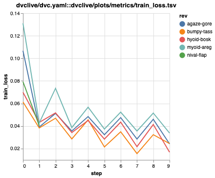

# DVCLive Experiment Tracking

Example repo to show how to start tracking experiments in DVC by adding DVCLive to your Python code.

Based on https://pytorch-lightning.readthedocs.io/en/stable/starter/introduction.html.

## Instructions

1. Clone the repo:

    ```
    git clone git@github.com:iterative/dvclive-exp-tracking.git
    ```

2. Install the requirements:

    ```
    pip install -r requirements.txt
    ```

3. Run the code in `dvclive_exp_tracking.py`:

    ```
    python train.py
    ```

4. Make some changes (for example, modify `encoder_size`) and run again.

5. Compare experiments:

    a. VS Code: Use the [DVC extension](https://marketplace.visualstudio.com/items?itemName=Iterative.dvc).

    

    b. Command line:

        # Show the experiments table.
        $ dvc exp show
         ────────────────────────────────────────────────────────────────────────────────
          Experiment                 Created    train_loss   epoch   step   encoder_size
         ────────────────────────────────────────────────────────────────────────────────
          workspace                  -            0.024467       4     10   96
          main                       10:46 AM            -       -      -   -
          ├── 728aa53 [bumpy-tass]   10:53 AM     0.024467       4     10   96
          ├── ce8adea [hyoid-bosk]   10:53 AM     0.016811       4     10   80
          ├── bec3030 [agaze-gore]   10:52 AM     0.024214       4     10   32
          ├── 0b9595f [myoid-areg]   10:52 AM     0.033773       4     10   16
          └── 8466fbd [nival-flap]   10:52 AM     0.040422       0      2   64
         ────────────────────────────────────────────────────────────────────────────────

        # Plot the diff of all experiments.
        $ dvc plots diff $(dvc exp list --name-only)

    