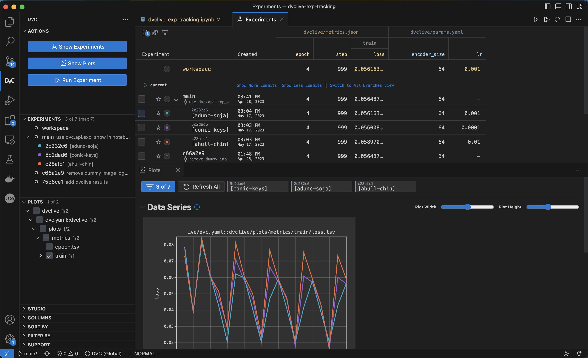

# DVCLive Experiment Tracking

Example repo to show how to start tracking experiments in DVC by adding DVCLive to your Python code.

Based on https://pytorch-lightning.readthedocs.io/en/stable/starter/introduction.html.

## Instructions

1. Clone the repo:

    ```
    git clone git@github.com:iterative/dvclive-exp-tracking.git
    ```

2. Install the requirements:

    ```
    pip install -r requirements.txt
    ```

3. Run the code in [dvclive-exp-tracking.ipynb](dvclive-exp-tracking.ipynb) and get live updates to your metrics and plots inside the notebook.

4. Make some changes (for example, modify `lr`) and run again.

5. Compare experiments:

    a. VS Code: Use the [DVC extension](https://marketplace.visualstudio.com/items?itemName=Iterative.dvc).

    

    b. Command line:

        # Show the experiments table.
        $ dvc exp show
        ───────────────────────────────────────────────────────────────────────────────────────────── 
        Experiment                 Created        train.loss   epoch   step   encoder_size   lr      
        ───────────────────────────────────────────────────────────────────────────────────────────── 
        workspace                  -                0.056163       4    999   64             0.001   
        main                       Apr 28, 2023     0.056488       4    999   64             -       
        ├── 2c232c6 [adunc-soja]   03:04 PM         0.056163       4    999   64             0.001   
        ├── 5c2dad6 [conic-keys]   03:03 PM         0.056009       4    999   64             0.0001  
        └── c28afc1 [ahull-chin]   03:03 PM          0.05897       4    999   64             0.01    
        ───────────────────────────────────────────────────────────────────────────────────────────── 

        # Plot the diff of all experiments.
        $ dvc plots diff $(dvc exp list --name-only)

    
