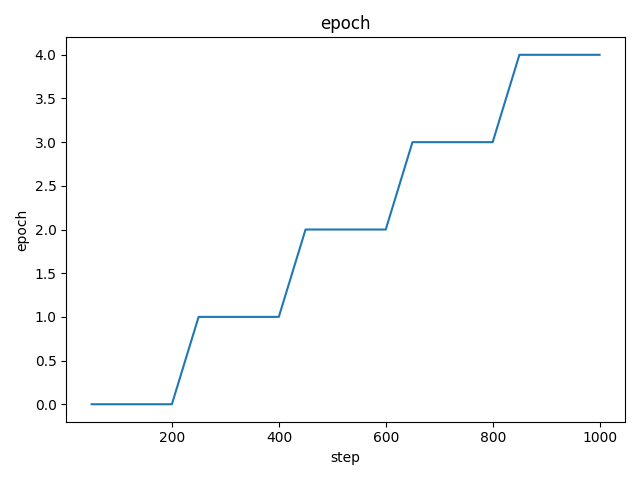
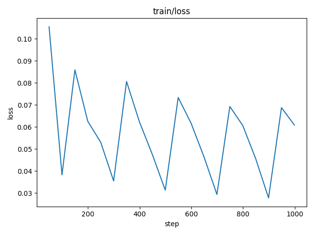

# DVC Report

params.yaml

|   encoder_size |
|----------------|
|             32 |

metrics.json

|   train.loss |   epoch |   step |
|--------------|---------|--------|
|    0.0621511 |       4 |    999 |

